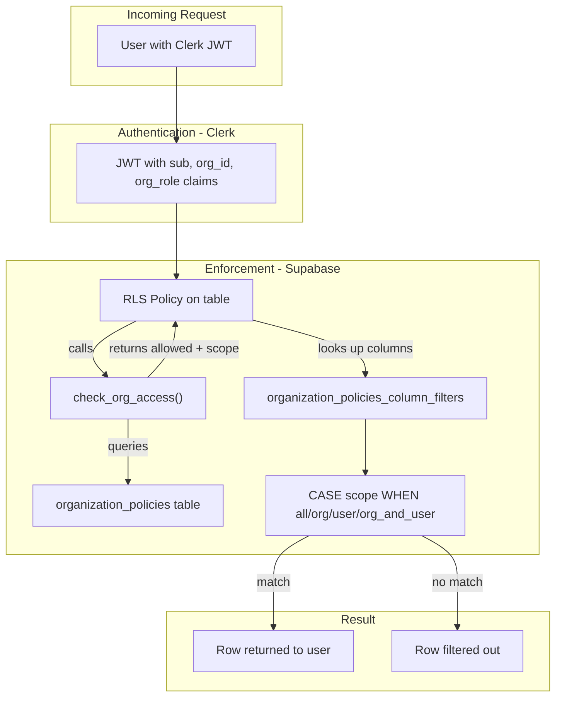
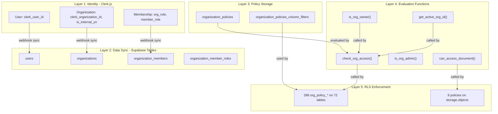
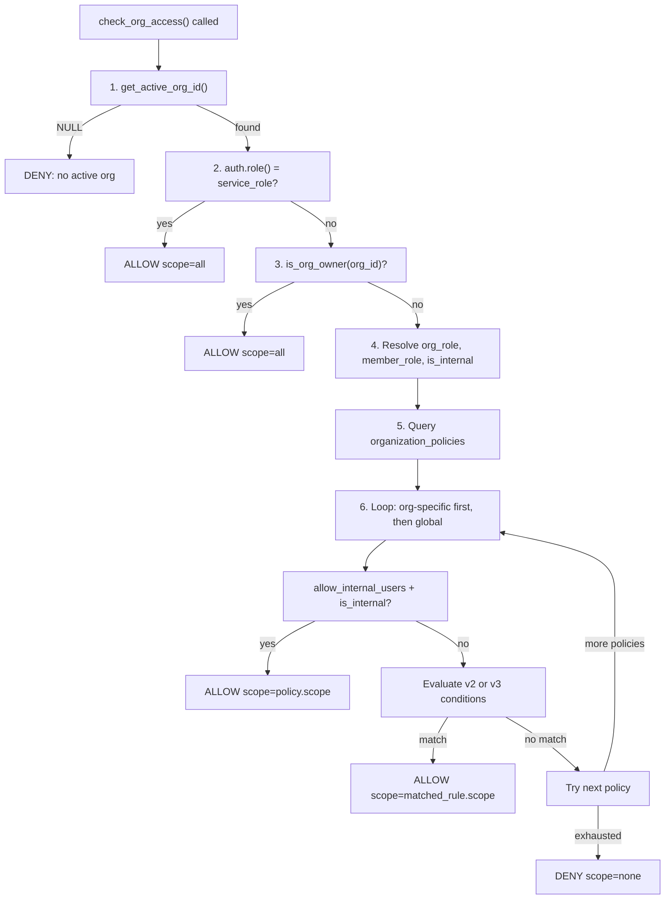
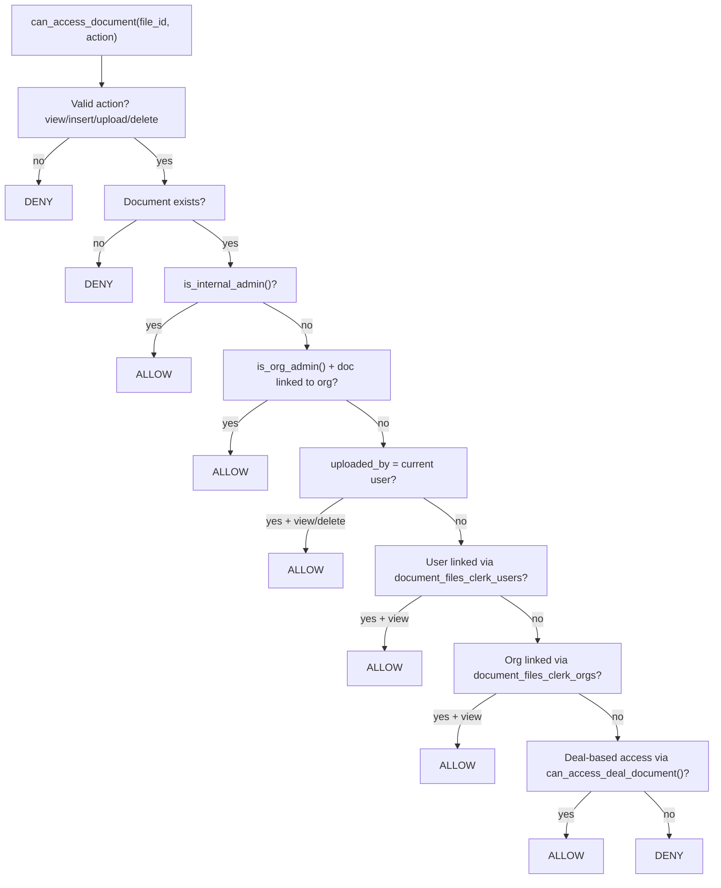
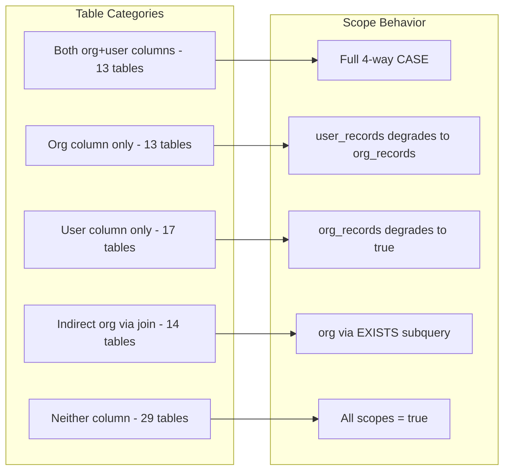

# Custom Permissions & Policies System

## Developer Documentation

**Version**: 3.0 (v3 multi-rule with row-level scoping)
**Last updated**: 2026-02-11
**Stack**: Next.js 16 + Clerk.js + Supabase (PostgreSQL + Storage) + Turborepo

---

## Table of Contents

1. [Architecture Overview](#1-architecture-overview)
2. [System Layers](#2-system-layers)
3. [Database Schema](#3-database-schema)
4. [Helper Functions Reference](#4-helper-functions-reference)
5. [Policy Evaluation Flow](#5-policy-evaluation-flow)
6. [Row-Level Scoping (4-Way Scope)](#6-row-level-scoping-4-way-scope)
7. [RLS Generator](#7-rls-generator)
8. [Storage Access Control](#8-storage-access-control)
9. [Client-Side Enforcement](#9-client-side-enforcement)
10. [Policy Builder UI](#10-policy-builder-ui)
11. [Default Policies (A/B/C/D Rules)](#11-default-policies-abcd-rules)
12. [Known Limitations](#12-known-limitations)
13. [Step-by-Step Replication Guide](#13-step-by-step-replication-guide)

---

## 1. Architecture Overview

This system implements a hybrid **RLS + RBAC + Custom Rule Builder** for multi-tenant access control. It combines three enforcement layers:

1. **PostgreSQL Row Level Security (RLS)** -- enforced at the database level on every query
2. **Condition-based policy engine** -- evaluates dynamic rules stored in `organization_policies`
3. **Row-level scoping** -- restricts which rows a user can see based on org/user ownership



### Key Design Decisions

- **Database as single source of truth**: All access decisions happen in PostgreSQL via `SECURITY DEFINER` functions. The application layer cannot bypass RLS.
- **Condition-based policies (not per-user ACLs)**: Policies define rules like "if org_role is admin AND org_type is internal, allow CRUD on all tables." This scales better than per-user-per-resource ACL entries.
- **Composite return type**: `check_org_access()` returns both `allowed` (boolean) and `scope` (text) in a single evaluation pass, avoiding duplicate policy lookups.
- **Backward compatibility**: `can_access_org_resource()` is a thin boolean wrapper around `check_org_access()`, so existing code that only needs allow/deny still works.

---

## 2. System Layers



---

## 3. Database Schema

### 3.1 `organization_policies`

Stores all access policies (org-specific and global defaults).

| Column | Type | Default | Description |
|--------|------|---------|-------------|
| `id` | uuid | `gen_random_uuid()` | Primary key |
| `org_id` | uuid (nullable) | NULL | Organization FK; NULL = global default |
| `resource_type` | text | -- | `'table'` or `'storage_bucket'` |
| `resource_name` | text | `'*'` | Table/bucket name; `'*'` = wildcard (all) |
| `action` | text | -- | `'select'`, `'insert'`, `'update'`, `'delete'`, or `'all'` |
| `definition_json` | jsonb | -- | Human-readable policy definition |
| `compiled_config` | jsonb | -- | Machine-evaluated policy (conditions, rules) |
| `scope` | text | `'all'` | Row-level scope: `'all'`, `'org_records'`, `'user_records'`, `'org_and_user'` |
| `version` | integer | 1 | Incremented on each update |
| `is_active` | boolean | true | Soft disable toggle |
| `created_at` | timestamptz | `now()` | Creation timestamp |
| `created_by_clerk_sub` | text | NULL | Clerk user ID of creator |

**Unique constraint**: `(org_id, resource_type, resource_name, action)`

**Policy priority order**:
1. Org-specific (`org_id IS NOT NULL`) before global (`org_id IS NULL`)
2. Specific resource name before wildcard (`'*'`)

### 3.2 `organization_policies_column_filters`

Registry mapping each table to its org/user ownership columns. Used by the RLS generator.

| Column | Type | Default | Description |
|--------|------|---------|-------------|
| `table_name` | text (unique) | -- | Public table name |
| `schema_name` | text | `'public'` | Schema name |
| `org_column` | text (nullable) | NULL | Column holding org UUID (e.g., `organization_id`) |
| `user_column` | text (nullable) | NULL | Column holding user ID (e.g., `user_id`, `uploaded_by`) |
| `user_column_type` | text | `'clerk_id'` | `'clerk_id'` (text match) or `'pk'` (bigint FK to users.id) |
| `join_path` | text (nullable) | NULL | Arrow notation for indirect org: `fk_col->parent_table->parent_org_col` |
| `is_excluded` | boolean | false | If true, RLS generator skips this table |

**78 entries**: 6 excluded system tables + 72 application tables.

### 3.3 `compiled_config` Format

#### v2 (single condition set)

```json
{
  "version": 2,
  "allow_internal_users": false,
  "conditions": [
    { "field": "org_role", "operator": "is", "values": ["admin", "owner"] }
  ],
  "connector": "AND",
  "scope": "all"
}
```

#### v3 (multiple rule groups with per-rule scopes)

```json
{
  "version": 3,
  "rules": [
    {
      "conditions": [
        { "field": "org_type", "operator": "is", "values": ["internal"] },
        { "field": "org_role", "operator": "is", "values": ["admin", "owner"] }
      ],
      "connector": "AND",
      "scope": "all"
    },
    {
      "conditions": [
        { "field": "org_type", "operator": "is", "values": ["external"] },
        { "field": "org_role", "operator": "is", "values": ["admin", "owner"] }
      ],
      "connector": "AND",
      "scope": "org_and_user"
    }
  ]
}
```

**Supported condition fields:**

| Field | Resolved From | Values |
|-------|--------------|--------|
| `org_role` | JWT `org_role` claim or `organization_members.clerk_org_role` | `owner`, `admin`, `member`, `broker` |
| `member_role` | JWT `org_member_role` claim or `organization_members.clerk_member_role` | Dynamic from `organization_member_roles` |
| `org_type` | `organizations.is_internal_yn` | `internal`, `external` |
| `internal_user` | `users.is_internal_yn` | `yes`, `no` |

**Supported operators:** `is` (matches any value in array), `is_not` (matches none)

**Supported connectors:** `AND` (all conditions must match), `OR` (any condition can match)

---

## 4. Helper Functions Reference

### 4.1 `check_org_access(resource_type, resource_name, action)` -- MAIN GATE

**Returns**: `org_access_result (allowed boolean, scope text)`

**Purpose**: The central access control function. Evaluates all matching policies and returns whether the action is allowed and what row-level scope applies.

**Evaluation order (dominance hierarchy)**:



**Use cases**:
- Called by every `org_policy_*` RLS policy on every table (288 policies across 72 tables)
- Called indirectly via `can_access_org_resource()` by the `/api/policies/check` endpoint

### 4.2 `can_access_org_resource(resource_type, resource_name, action)` -- BOOLEAN WRAPPER

**Returns**: `boolean`

**Purpose**: Thin wrapper that returns only the `allowed` field from `check_org_access()`. Exists for backward compatibility with code that only needs allow/deny.

```sql
SELECT (public.check_org_access(p_resource_type, p_resource_name, p_action)).allowed;
```

**Use cases**:
- Called by `/api/policies/check` route handler via RPC
- Can be called directly in application code for simple allow/deny checks

### 4.3 `get_active_org_id()` -- ORG RESOLVER

**Returns**: `uuid`

**Purpose**: Resolves the active organization's internal UUID from the JWT `org_id` claim (Clerk organization ID).

```sql
SELECT co.id FROM public.organizations co
WHERE co.clerk_organization_id = (auth.jwt() ->> 'org_id') LIMIT 1;
```

**Use cases**:
- Called by `check_org_access()` to determine which org's policies to evaluate
- Called by RLS scope CASE expressions to compare `org_column = get_active_org_id()`
- Called by `can_access_document()` for document org membership checks

### 4.4 `get_clerk_user_id()` -- USER RESOLVER

**Returns**: `text`

**Purpose**: Returns the Clerk user ID from the JWT `sub` claim.

```sql
SELECT auth.jwt() ->> 'sub';
```

**Use cases**:
- Called by `can_access_document()` to check document uploader ownership

### 4.5 `is_org_owner(org_id)` -- OWNER BYPASS

**Returns**: `boolean`

**Purpose**: Checks if the current user is the **owner** of the specified organization. Owners bypass all policy evaluation.

```sql
SELECT EXISTS (
  SELECT 1 FROM organization_members m
  WHERE m.organization_id = p_org_id
    AND m.user_id = (auth.jwt() ->> 'sub')
    AND lower(replace(coalesce(m.clerk_org_role, ''), 'org:', '')) = 'owner'
);
```

**Use cases**:
- Called by `check_org_access()` as priority-2 bypass (after service_role)
- Ensures org owners can never be locked out by misconfigured policies

### 4.6 `is_org_admin(org_id)` -- ADMIN CHECK

**Returns**: `boolean`

**Purpose**: Checks if the current user is an **admin or owner** of the specified organization.

**Use cases**:
- Called by `can_access_document()` for document admin access
- Called by `can_access_deal_document()` for deal document admin access
- Used in `organization_policies` RLS to allow admins to manage policies

### 4.7 `can_access_document(document_file_id, action)` -- DOCUMENT ACCESS

**Returns**: `boolean`

**Purpose**: Fine-grained document access control. Checks multiple access paths in order:



**Use cases**:
- Called by `deals` storage bucket RLS policies for SELECT, UPDATE, DELETE
- Provides the bridge between storage objects and the document management tables

### 4.8 `can_access_deal_document(deal_id, category_id, action)` -- DEAL DOCUMENT ACCESS

**Returns**: `boolean`

**Purpose**: Checks deal-level document access using deal role assignments and document access permissions (RBAC matrix).

**Use cases**:
- Called by `can_access_document()` as the final access check
- Implements the RBAC matrix defined on the `/settings/permissions` page

### 4.9 `create_default_org_policies()` -- TRIGGER FUNCTION

**Returns**: `trigger`

**Purpose**: Automatically creates 8 default policies (4 for tables, 4 for storage buckets) when a new organization is inserted. Uses v3 multi-rule format with A/B/C/D scopes.

**Use cases**:
- Attached as `AFTER INSERT` trigger on `organizations` table
- Ensures no organization starts with zero policies

---

## 5. Policy Evaluation Flow

### 5.1 How a SELECT query is evaluated

```
User sends: SELECT * FROM deals WHERE ...

1. PostgreSQL checks RLS policy "org_policy_select" on deals table

2. RLS USING clause calls: check_org_access('table', 'deals', 'select')
   a. Resolves org_id from JWT
   b. Checks owner bypass
   c. Resolves org_role, member_role, org_type
   d. Queries organization_policies for matching policies
   e. Evaluates conditions against user context
   f. Returns (allowed=true, scope='org_and_user')

3. RLS evaluates scope CASE:
   CASE scope
     WHEN 'all' -> true (return all matching rows)
     WHEN 'org_records' -> deals.organization_id = get_active_org_id()
     WHEN 'user_records' -> deals.primary_user_id = auth.jwt()->>'sub'
     WHEN 'org_and_user' -> deals.organization_id = get_active_org_id()
                            OR deals.primary_user_id = auth.jwt()->>'sub'

4. Only rows passing both the action gate AND the scope filter are returned
```

### 5.2 Policy matching priority

| Priority | Criteria | Example |
|----------|----------|---------|
| 1 (highest) | Org-specific + specific resource | `org_id=uuid, resource_name='deals', action='select'` |
| 2 | Org-specific + wildcard resource | `org_id=uuid, resource_name='*', action='select'` |
| 3 | Global + specific resource | `org_id=NULL, resource_name='deals', action='select'` |
| 4 (lowest) | Global + wildcard resource | `org_id=NULL, resource_name='*', action='select'` |

The first matching policy wins. This enables per-table overrides on top of wildcard defaults.

---

## 6. Row-Level Scoping (4-Way Scope)

### 6.1 Scope values

| Scope | Meaning | WHERE clause generated |
|-------|---------|----------------------|
| `all` | User sees all rows | `true` (no filter) |
| `org_records` | User sees only org's rows | `org_column = get_active_org_id()` |
| `user_records` | User sees only their rows | `user_column = auth.jwt()->>'sub'` |
| `org_and_user` | User sees org rows + their rows | `org_column = get_active_org_id() OR user_column = ...` |

### 6.2 Table categories and scope behavior



### 6.3 Generated RLS examples by category

**Both columns (e.g., `deals`):**
```sql
CREATE POLICY org_policy_select ON public.deals
  FOR SELECT TO authenticated
  USING (
    (check_org_access('table', 'deals', 'select')).allowed
    AND CASE (check_org_access('table', 'deals', 'select')).scope
      WHEN 'all' THEN true
      WHEN 'org_records' THEN organization_id = get_active_org_id()
      WHEN 'user_records' THEN primary_user_id = (auth.jwt() ->> 'sub')
      WHEN 'org_and_user' THEN
        organization_id = get_active_org_id()
        OR primary_user_id = (auth.jwt() ->> 'sub')
      ELSE false
    END
  );
```

**Indirect org via join (e.g., `deal_comments`):**
```sql
WHEN 'org_records' THEN EXISTS (
  SELECT 1 FROM public.deals
  WHERE deals.id = deal_comments.deal_id::uuid
    AND deals.organization_id = get_active_org_id()
)
WHEN 'user_records' THEN author_clerk_user_id = (auth.jwt() ->> 'sub')
WHEN 'org_and_user' THEN
  EXISTS (...) OR author_clerk_user_id = (auth.jwt() ->> 'sub')
```

**Neither column (e.g., `program_documents`):**
```sql
USING (
  (check_org_access('table', 'program_documents', 'select')).allowed
);
-- No scope CASE -- action gate is the sole control
```

---

## 7. RLS Generator

The RLS generator is a SQL migration that dynamically creates RLS policies for all non-excluded tables based on the `organization_policies_column_filters` registry.

### 7.1 How it works

1. Iterates all rows in `organization_policies_column_filters` where `is_excluded = false`
2. For each table, drops existing `org_policy_*` policies
3. Looks up `org_column`, `user_column`, `user_column_type`, `join_path`
4. Generates 4 policies (select, insert, update, delete) with appropriate scope CASE
5. Handles type mismatches (e.g., text FK to uuid parent) with automatic casting

### 7.2 Adding a new table

When creating a new public table in a migration:

```sql
-- 1. Create your table
CREATE TABLE public.my_new_table (
  id uuid PRIMARY KEY DEFAULT gen_random_uuid(),
  organization_id uuid REFERENCES organizations(id),
  created_by text,
  ...
);

-- 2. Register in column_filters
INSERT INTO public.organization_policies_column_filters
  (table_name, org_column, user_column, user_column_type)
VALUES
  ('my_new_table', 'organization_id', 'created_by', 'clerk_id');

-- 3. Enable RLS and create policies
ALTER TABLE public.my_new_table ENABLE ROW LEVEL SECURITY;

CREATE POLICY org_policy_select ON public.my_new_table
  FOR SELECT TO authenticated
  USING (
    (check_org_access('table', 'my_new_table', 'select')).allowed
    AND CASE (check_org_access('table', 'my_new_table', 'select')).scope
      WHEN 'all' THEN true
      WHEN 'org_records' THEN organization_id = get_active_org_id()
      WHEN 'user_records' THEN created_by = (auth.jwt() ->> 'sub')
      WHEN 'org_and_user' THEN
        organization_id = get_active_org_id()
        OR created_by = (auth.jwt() ->> 'sub')
      ELSE false
    END
  );
-- Repeat for insert, update, delete
```

---

## 8. Storage Access Control

Storage uses a **separate access control path** from tables. Files in Supabase Storage are accessed via `storage.objects`, which has its own RLS policies.

```mermaid
flowchart TD
  subgraph buckets [4 Storage Buckets]
    Deals["deals - private"]
    Companies["companies - private"]
    Persons["persons - private"]
    OrgAssets["org-assets - public read"]
  end

  subgraph dealsEnforcement [Deals Bucket - 5 Policies]
    AdminFull["is_internal_admin() -> full access"]
    DocSelect["can_access_document(df.id, view)"]
    DocInsert["can_access_document(df.id, upload)"]
    DocUpdate["can_access_document(df.id, upload)"]
    DocDelete["can_access_document(df.id, delete)"]
  end

  subgraph docLookup [Document Lookup Chain]
    StorageObj["storage.objects.name"]
    DocFiles["document_files.storage_path"]
    DocAccess["can_access_document()"]
    DealRoles["deal_roles + document_access_permissions"]
  end

  Deals --> AdminFull
  Deals --> DocSelect
  StorageObj -->|"matched by"| DocFiles
  DocFiles -->|"resolved to"| DocAccess
  DocAccess -->|"checks"| DealRoles

  Companies -->|"org_policy_* RLS"| OrgPolicy["check_org_access(storage_bucket, ...)"]
  Persons -->|"org_policy_* RLS"| OrgPolicy
  OrgAssets -->|"public"| PublicRead["No auth for read"]
```



### Path scheme

| Bucket | Path Pattern | Scope |
|--------|-------------|-------|
| `deals` | `{org_id}/{deal_id}/{category}/{filename}` | Per-deal via document_files |
| `companies` | `{org_id}/{filename}` | Per-org via org_policy RLS |
| `persons` | `{user_id}/{filename}` | Per-user via org_policy RLS |
| `org-assets` | `{org_id}/{filename}` | Public read, authenticated write |

---

## 9. Client-Side Enforcement

### 9.1 Current state

There are two client-side systems, currently **disconnected** from the DB policy engine:

| System | Source of Truth | What it checks |
|--------|----------------|----------------|
| `RouteProtection` component | Clerk `publicMetadata` | contactType, role, permission flags |
| `/api/policies/check` endpoint | Supabase `can_access_org_resource()` | DB-level policy evaluation |

### 9.2 `useUserPermissions` hook

Reads Clerk `publicMetadata` for `contactType`, `role`, and boolean permission flags. Does NOT query the database.

### 9.3 `/api/policies/check` endpoint

```typescript
POST /api/policies/check
Body: { resourceType, resourceName, action }
Response: { allowed: boolean }
```

Calls `can_access_org_resource()` via Supabase RPC. This IS connected to the DB policy engine but is **not currently called** by any UI component.

### 9.4 Recommended integration

To connect client-side enforcement to the DB policies, wire `RouteProtection` to call `/api/policies/check` before rendering protected pages.

---

## 10. Policy Builder UI

### 10.1 Components

| Component | File | Purpose |
|-----------|------|---------|
| `OrgPolicyBuilder` | `org-policy-builder.tsx` | Main builder with create/edit/delete, scope selector, inventory |
| `PolicyConditionRow` | `policy-condition-row.tsx` | Single condition row (field, operator, values) |
| `ChipsSelect` | Inline in builder | Multi-select combobox with chip badges |

### 10.2 UI sections

1. **When** -- Condition builder with AND/OR connectors
2. **Set permissions to** -- Action multi-select (select, insert, update, delete)
3. **on** -- Resource multi-select (All Tables, specific tables, specific buckets)
4. **scoped to** -- Row scope radio group (All / Org / User / Org+User)
5. **Bypass for internal users** -- Toggle
6. **Existing Policies** -- List with edit/delete/toggle
7. **Policy Inventory** -- Read-only overview with coverage stats

### 10.3 Server actions

| Action | Purpose |
|--------|---------|
| `saveOrgPolicy()` | Create or upsert policy |
| `updateOrgPolicy()` | Update existing policy conditions/scope |
| `deleteOrgPolicy()` | Delete a policy |
| `setOrgPolicyActive()` | Toggle active/inactive |
| `getOrgPolicies()` | Fetch all policies for current org |
| `getAvailableResources()` | List tables and buckets for resource selector |
| `getColumnFilters()` | Get column filter data for conditional scope UI |
| `getMemberRolesForPolicies()` | Fetch member roles for condition values |

---

## 11. Default Policies (A/B/C/D Rules)

Auto-created for each new organization via the `create_default_org_policies()` trigger.

| Rule | Conditions | Actions | Scope |
|------|-----------|---------|-------|
| **A**: Internal admin/owner | org_type=internal AND org_role in (admin, owner) | CRUD | `all` |
| **B**: Internal non-admin | org_type=internal AND org_role not in (admin, owner) | CRU | `all` |
| **C**: External admin/owner | org_type=external AND org_role in (admin, owner) | CRU | `org_and_user` |
| **D**: External non-admin | org_type=external AND org_role not in (admin, owner) | CRU | `user_records` |

**Delete** is restricted to Rule A only (internal admins/owners).

Global defaults (`org_id IS NULL`) serve as fallback for organizations that have no org-specific policies.

---

## 12. Known Limitations

### 12.1 Client-side/DB-side disconnect

`RouteProtection` reads Clerk `publicMetadata` and has **no awareness** of DB-stored policies. A user could be denied data by RLS but still see the page skeleton, leading to empty or error states.

**Mitigation**: Wire `RouteProtection` to call `/api/policies/check` for DB-level verification.

### 12.2 Storage policies use a separate access path

Storage bucket access (`can_access_document`) is **not connected** to the `organization_policies` table. Storage uses its own function chain (`can_access_document` -> `can_access_deal_document` -> deal_roles + document_access_permissions). The `scope` column in `organization_policies` does not affect storage access.

**Impact**: You cannot use the policy builder UI to create per-file or per-path storage access rules. Storage access is governed by deal membership, org admin status, and uploader ownership.

### 12.3 No per-column granularity

The system controls access at the **table + row** level but not at the **column** level. You cannot hide specific columns from certain roles (e.g., "members can see `deal_name` but not `deal_amount`").

**Mitigation**: Use Supabase views or server-side field filtering.

### 12.4 No deny policies

The system only supports `ALLOW` policies. There is no way to create a policy that explicitly denies access. If no policy matches, access is denied by default (closed by default).

### 12.5 `check_org_access()` is called twice per row

In the generated RLS, `check_org_access()` is referenced twice in the USING clause (once for `.allowed`, once for `.scope`). While PostgreSQL's query planner should optimize this for `STABLE` functions, it may result in double evaluation under some conditions.

**Mitigation**: Monitor query performance. If needed, refactor the RLS generator to use a subquery/CTE pattern.

### 12.6 Indirect scope relies on FK integrity

The EXISTS subqueries for indirect org scope (e.g., `deal_comments -> deals -> organization_id`) assume FK relationships are maintained. If a deal_comment references a deleted deal, the EXISTS check will fail and the row becomes inaccessible.

### 12.7 `user_column_type = 'pk'` requires subquery

Tables where the user column is a bigint FK to `users.id` (e.g., `deal_roles.users_id`) require a subquery to resolve the Clerk user ID to the internal user PK. This adds overhead per row.

---

## 13. Step-by-Step Replication Guide

To implement this system in another Supabase + Clerk project:

### Step 1: Prerequisites

- Supabase project with PostgreSQL
- Clerk.js authentication with JWT templates
- Clerk JWT template named `supabase` configured with your Supabase JWT secret (HS256)

### Step 2: Create the identity sync tables

```sql
CREATE TABLE public.organizations (
  id uuid PRIMARY KEY DEFAULT gen_random_uuid(),
  clerk_organization_id text UNIQUE NOT NULL,
  is_internal_yn boolean DEFAULT false,
  name text
);

CREATE TABLE public.users (
  id bigserial PRIMARY KEY,
  clerk_user_id text UNIQUE NOT NULL,
  is_internal_yn boolean DEFAULT false
);

CREATE TABLE public.organization_members (
  id uuid PRIMARY KEY DEFAULT gen_random_uuid(),
  organization_id uuid REFERENCES organizations(id),
  user_id text NOT NULL,  -- Clerk user ID
  clerk_org_role text,
  clerk_member_role text
);
```

### Step 3: Create helper functions

Copy these functions in order:
1. `get_active_org_id()` -- resolves org UUID from JWT
2. `get_clerk_user_id()` -- returns JWT sub
3. `is_org_owner()` -- owner bypass check
4. `is_org_admin()` -- admin check

**Critical**: All functions must use `auth.jwt() ->> 'sub'` (not `auth.uid()::text`) for Clerk compatibility.

### Step 4: Create the policy storage tables

1. `organization_policies` with scope column and CHECK constraint
2. `organization_policies_column_filters` with column registry

### Step 5: Create the composite type and `check_org_access()`

```sql
CREATE TYPE public.org_access_result AS (allowed boolean, scope text);

CREATE OR REPLACE FUNCTION public.check_org_access(...)
RETURNS public.org_access_result
-- (full function from migration 20260211010000)
```

### Step 6: Create `can_access_org_resource()` wrapper

```sql
CREATE OR REPLACE FUNCTION public.can_access_org_resource(...)
RETURNS boolean AS $$
  SELECT (public.check_org_access(...)).allowed;
$$;
```

### Step 7: Seed the column filters registry

For every public table, INSERT a row into `organization_policies_column_filters` specifying:
- Which column holds the org FK (if any)
- Which column holds the user ID (if any)
- Whether the user column is a text Clerk ID or bigint PK
- The join path for indirect org relationships (if any)

### Step 8: Run the RLS generator

Create a migration that loops through all non-excluded tables in the column_filters registry and generates 4 RLS policies per table using the `check_org_access()` function and scope CASE expressions.

### Step 9: Create the default policy trigger

Create `create_default_org_policies()` trigger function and attach it to the organizations table as `AFTER INSERT`.

### Step 10: Seed global defaults

Insert global default policies (`org_id IS NULL`) for each action/resource_type combination.

### Step 11: Build the UI

Create the policy builder component with:
- Condition rows (field, operator, multi-select values)
- Action and resource selectors
- Scope radio group
- Save/edit/delete functionality
- Policy inventory view
